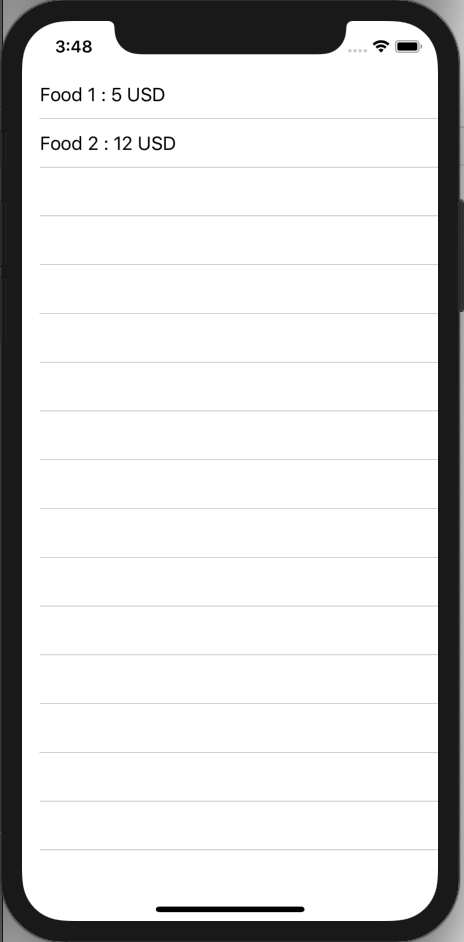
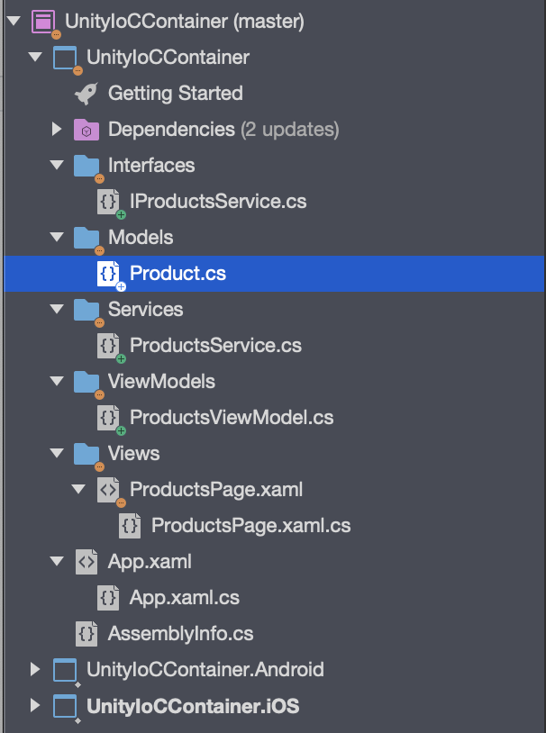

Để hiểu được bài này thì phải nắm được thế nào là [Dependence Injection](https://blog.quilv.com/blog/dependency-injection-trong-net/) (DI). Nếu chưa nắm được thì đọc [ở đây](https://blog.quilv.com/blog/dependency-injection-trong-net/).

## **Ví dụ đơn giản để hiểu cách sử dụng Dependence Injection :**

### Thiết kế ứng dụng load danh sách Product gồm 2 thông tin:

* Name
* Price

Xây dựng theo mô hình MVVM: 

* Models: Product chứa 2 thông tin Name & Price
* Views: ProductsPage : show thông tin bao gồm name & price của list Products trong listview.
* ViewModels: ProductsViewModel: chứa list Products được load từ 1 server thông qua 1 Service Class. ( ProductsService)

Yêu cầu sử dụng Dependence Injection để giảm sự liên kết cứng giữa ProductsViewModel & Service (ProductsService) để có thể sử dụng Unit Test.




### Trong trường hợp không sử dụng DI, thì các class được cấu hình như sau:



Với các Class:

```csharp
//Product
public class Product
{
    public string Name { get; set; }
    public double Price { get; set; }
    public override string ToString()
    {
        return $"{Name} : {Price} USD";
    }
}

//Interface
public interface IProductsService
{
    IEnumerable<Product> Getproducts();
}

//Service Load Test Data
public class ProductsService: IProductsService
{
    public ProductsService()
    {
    }

    public IEnumerable<Product> Getproducts()
    {
        return new List<Product> {
            new Product { Name = "Food 1", Price = 5 },
            new Product { Name = "Food 2", Price = 12 },
        };
    }
}

// ViewsModel
public class ProductsViewModel
{
    public IEnumerable<Product> Products { get; set; }
    public ProductsViewModel()
    {
        var productsService = new ProductsService();
        Products = productsService.Getproducts();
    }
}
```

Như trên, thì ta thấy sự liên kết cứng giữa ProductsViewModel & ProductService. Nếu trường hợp ProductService do bên thứ 3 cung cấp & họ bỏ phương thức khởi tạo ko có tham số, nếu như trong code chúng ta có rất nhiều chỗ implement phương thức khởi tạo đó, thì chúng ta phải thay đổi lại hết. Và cái này liên kết cứng nên chúng ta không thể viết Unit Test cho trường hợp này được.


## Tiến hành implement DI với Unity Container trong Xamarin.