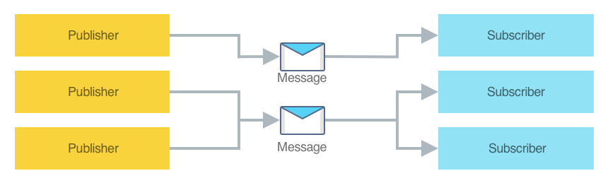

Event trong .NET sử dụng pattern publish - subscribe pattern. Đây là cái đơn giản nhất để truyền thông tin giữa các components nếu như ko yêu cầu sự kết nối giữa chặt chẽ giữa các components.

Tuy nhiên vòng đời của publisher & subscriber phải liên kết đến các object, và subscriber type thì phải liên kết với publisher type. Điều này có khả năng tạo leak memory.( trường hợp có quá nhiều object tạm subscribe đến event của 1 static hoặc long-live object). Nếu subscriber ko được remove thì object đã liên kết đến publisher (long-live) vẫn giữ, nên nó sẽ ko được giải phóng khỏi bộ nhớ.



MessagingCenter  X.F implements publish-subscribe pattern. Cơ chế giúp publisher-subscriber trao đổi thông tin mà ko có sự liên kết nào như trên. 

Messaging Center hỗ trợ multicast ( đa hướng) : nhiều publishers có thể gửi cùng 1 loại tin và có nhiều subscribers đăng ký lắng nghe đến 1 loại tin.

* MessagingCenter.Send
* MessagingCenter.Subscribe
* MessagingCenter.Unsubscribe

> Internally, the [`MessagingCenter`](https://docs.microsoft.com/en-us/dotnet/api/xamarin.forms.messagingcenter) class uses weak references. This means that it will not keep objects alive, and will allow them to be garbage collected. Therefore, it should only be necessary to unsubscribe from a message when a class no longer wishes to receive the message.

## Publish a message

```csharp
MessagingCenter.Send<MainPage>(this, "Hi");
```

hoặc

```csharp
MessagingCenter.Send<MainPage, string>(this, "Hi", "John");
```

## Subscribe to a message

```csharp
MessagingCenter.Subscribe<MainPage> (this, "Hi", (sender) =>
{
    // Do something whenever the "Hi" message is received
});
```

hoặc trường hợp get payload:

```csharp
MessagingCenter.Subscribe<MainPage, string>(this, "Hi", async (sender, arg) =>
{
    await DisplayAlert("Message received", "arg=" + arg, "OK");
});
```

`The delegate that's executed by the Subscribe method will be executed on the same thread that publishes the message using the Send method.`

## Unsubscribe from a message

```csharp
MessagingCenter.Unsubscribe<MainPage>(this, "Hi");

//hoặc
MessagingCenter.Unsubscribe<MainPage, string>(this, "Hi");
```


## Ví dụ để sử dụng MessagingCenter để liên lạc giữa các thành phần với nhau trong 1 ứng dụng enterprise:

Ứng dụng di động eShopOnContainers sử dụng lớp MessagingCenter để liên lạc giữa các thành phần được ghép lỏng lẻo. Ứng dụng xác định ba thông báo:

\* Message `AddProduct` được phát bởi `CatalogViewModel` khi có 1 item được add vào trong giỏ hàng. Ngược lại, `BasketViewModel` sẽ đăng ký lắng nghe message để tăng số lượng item trong giỏ hàng khi nó thay đổi. Và `BasketViewModel` cũng có khả năng hủy đăng ký lắng nghe.

\* `Filter` message được phát bởi CatalogViewModel khi user apply filter. Ngược lại, CatalogView đăng ký để lắng nghe message & update UI để phù hợp với nhu cầu cần hiển thị.

\* The `ChangeTab` message is published by the `MainViewModel` class when the `CheckoutViewModel` navigates to the `MainViewModel` following the successful creation and submission of a new order. In return, the `MainView` class subscribes to the message and updates the UI so that the **My profile** tab is active, to show the user's orders.

### Defining a Message:

```csharp
public class MessageKeys  
{  
    // Add product to basket  
    public const string AddProduct = "AddProduct";  

    // Filter  
    public const string Filter = "Filter";  

    // Change selected Tab programmatically  
    public const string ChangeTab = "ChangeTab";  
}
```

### Publishing a Message

```csharp
MessagingCenter.Send(this, MessageKeys.AddProduct, catalogItem);
```

## Subscribing to a Message

```csharp
MessagingCenter.Subscribe<CatalogViewModel, CatalogItem>(  
    this, MessageKeys.AddProduct, async (sender, arg) =>  
{  
    BadgeCount++;  

    await AddCatalogItemAsync(arg);  
});
```


> Tip
>
> Consider using immutable payload data. Don't attempt to modify the payload data from within a callback delegate because several threads could be accessing the received data simultaneously. In this scenario, the payload data should be immutable to avoid concurrency errors.

###  Unsubscribing from a Message

```csharp
MessagingCenter.Unsubscribe<CatalogViewModel, CatalogItem>(this, MessageKeys.AddProduct);
```