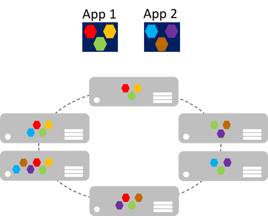
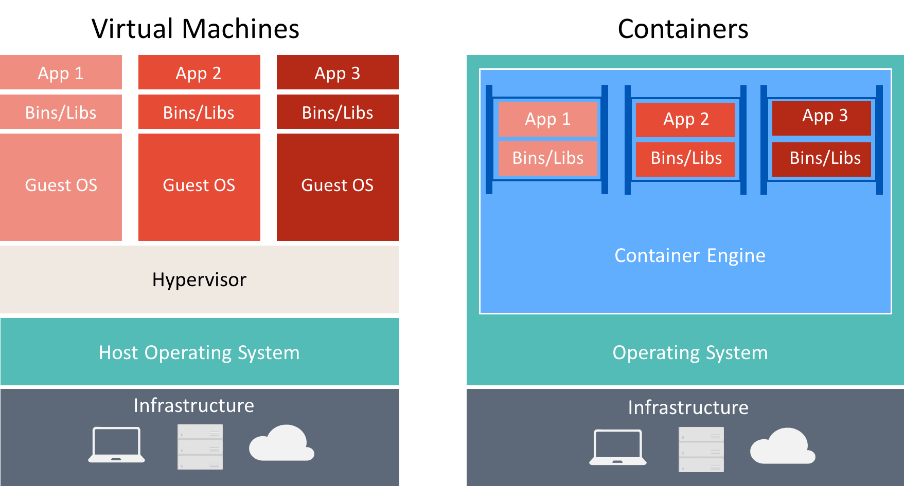
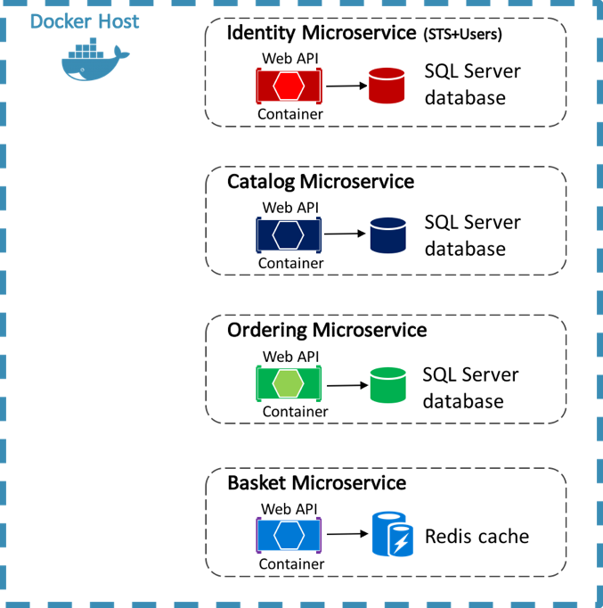
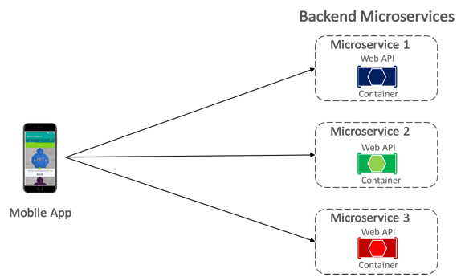

Microservice đảm bảo sự nhanh nhẹn, khả năng mở rộng, độ ổn định cao. 1 microservice có thể được tách rời và hoạt động cùng với các microservice khác để tạo thành 1 ứng dụng hoàn chỉnh.

Microservice nên bao gồm các dịch vụ đủ nhỏ để tạo nên service độc lập và đảm bảo nó sẽ thực hiện chức năng duy nhất của microservice đó. 1 Ứng dụng mua bán thường sẽ có các service sau:

\- shopping carts: giỏ hàng

\- inventory processing : quản lý kho hàng.

\- purchase subsystems

\- payment processing

Microservice mở rộng để đáp ứng nhu cầu:

Microservice có thể mở rộng gần như là tức thì. Cho phép ứng dụng đáp ứng được việc cân bằng tải.

Mô hình kinh điển cho việc mở rộng để cân bằng tải là : tầng stateless (ko trạng thái) với dữ liệu được chia sẽ bên ngoài để lưu những dữ liệu ko thay đổi (cache data). Các Stateful microservices quản lý các data ko thay đổi thường được lưu ở máy chủ cục bộ nơi chạy các microservice để tránh chi phí truy cập mạng & sự phức tạp khi quản lý chồng chéo các service với nhau. Điều này giúp việc xử lý data nhah nhất có thể và có thể loại bỏ được hệ thống lưu trữ. 

Lợi ích khi sử dụng microservice:

* Each microservice is relatively small, easy to manage and evolve.
* Each microservice can be developed and deployed independently of other services.
* Each microservice can be scaled-out independently. For example, a catalog service or shopping basket service might need to be scaled-out more than an ordering service. Therefore, the resulting infrastructure will more efficiently consume resources when scaling out.
* Each microservice isolates any issues. For example, if there is an issue in a service it only impacts that service. The other services can continue to handle requests.
* Each microservice can use the latest technologies. Because microservices are autonomous and run side-by-side, the latest technologies and frameworks can be used, rather than being forced to use an older framework that might be used by a monolithic application.

Tuy nhiên vẫn có nhược điểm dưới đây:

* Choosing how to partition an application into microservices can be challenging, as each microservice has to be completely autonomous, end-to-end, including responsibility for its data sources.
* Developers must implement inter-service communication, which adds complexity and latency to the application.
* Atomic transactions between multiple microservices usually aren't possible. Therefore, business requirements must embrace eventual consistency between microservices.
* In production, there is an operational complexity in deploying and managing a system compromised of many independent services.
* Direct client-to-microservice communication can make it difficult to refactor the contracts of microservices. For example, over time how the system is partitioned into services might need to change. A single service might split into two or more services, and two services might merge. When clients communicate directly with microservices, this refactoring work can break compatibility with client apps.

##  Containerization

So sánh giữa virtual machines & containers.

eShopOnContainers sử dụng Docker để làm máy chủ cho các dịch vụ của backend:

## Giao tiếp giữa mobile app & backend service:

