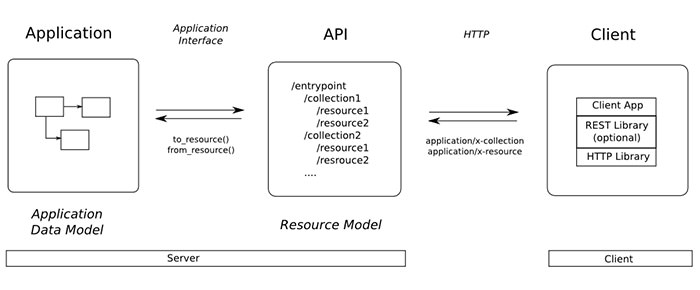

## Representational State Transfer (REST)

Có thể nói bản thân **REST** không phải là một loại công nghệ. Nó là phương thức tạo API với nguyên lý tổ chức nhất định. Những nguyên lý này nhằm hướng dẫn lập trình viên tạo môi trường xử lý API request được toàn diện.

Để hiểu rõ hơn về **RESTful API** ta sẽ đi lần lượt giải thích các khái niệm **API**, **REST** hay **RESTful**.

* **REST** (**RE**presentational **S**tate **T**ransfer) là một dạng chuyển đổi cấu trúc dữ liệu, một kiểu kiến trúc để viết API. Nó sử dụng phương thức HTTP đơn giản để tạo cho giao tiếp giữa các máy. Vì vậy, thay vì sử dụng một URL cho việc xử lý một số thông tin người dùng, REST gửi một yêu cầu HTTP như GET, POST, DELETE, vv đến một URL để xử lý dữ liệu.
* **API** (**A**pplication **P**rogramming **I**nterface) là một tập các quy tắc và cơ chế mà theo đó, một ứng dụng hay một thành phần sẽ tương tác với một ứng dụng hay thành phần khác. API có thể trả về dữ liệu mà bạn cần cho ứng dụng của mình ở những kiểu dữ liệu phổ biến như JSON hay XML
* **RESTful API** là một tiêu chuẩn dùng trong việc thiết kế các API cho các ứng dụng web để quản lý các resource. RESTful là một trong những kiểu thiết kế API được sử dụng phổ biến ngày nay để cho các ứng dụng (web, mobile…) khác nhau giao tiếp với nhau.

## Sử dụng RESTful APIs

RESTful không quy định logic code ứng dụng và không giới hạn bởi ngôn ngữ lập trình ứng dụng, bất kỳ ngôn ngữ hoặc framework nào cũng có thể sử dụng để thiết kế một **RESTful API**.




* GET (SELECT): Trả về một Resource hoặc một danh sách Resource.
* POST (CREATE): Tạo mới một Resource.
* PUT (UPDATE): Cập nhật thông tin cho Resource.
* DELETE (DELETE): Xoá một Resource.

Những phương thức hay hoạt động này thường được gọi là **CRUD** tương ứng với Create, Read, Update, Delete – Tạo, Đọc, Sửa, Xóa

**RESTful API** không sử dụng [](https://topdev.vn/blog/session-la-gi/)session và cookie, nó sử dụng một access_token với mỗi request. Dữ liệu trả về thường có cấu trúc như sau:

```jsonld
{
    "data" : {
        "id": "1",
        "name": "Xamarin Form"
    }
}
```

### Status code

Khi chúng ta request một API nào đó thường thì sẽ có vài status code để nhận biết sau:

* 200 OK – Trả về thành công cho những phương thức GET, PUT, PATCH hoặc DELETE.
* 201 Created – Trả về khi một Resouce vừa được tạo thành công.
* 204 No Content – Trả về khi Resource xoá thành công.
* 304 Not Modified – Client có thể sử dụng dữ liệu cache.
* 400 Bad Request – Request không hợp lệ
* 401 Unauthorized – Request cần có auth.
* 403 Forbidden – bị từ chối không cho phép.
* 404 Not Found – Không tìm thấy resource từ URI
* 405 Method Not Allowed – Phương thức không cho phép với user hiện tại.
* 410 Gone – Resource không còn tồn tại, Version cũ đã không còn hỗ trợ.
* 415 Unsupported Media Type – Không hỗ trợ kiểu Resource này.
* 422 Unprocessable Entity – Dữ liệu không được xác thực
* 429 Too Many Requests – Request bị từ chối do bị giới hạn

> Luôn sử dụng version để khi bạn cần nâng cấp API mà vẫn hỗ trợ các API cũ.

Trong eShopOnContainers mobile app thì dùng mẫu MVVM, và model đại diện cho những thể hiện của các thành phần trong ứng dụng. Những lớp điều khiển & lưu giữ trong eShopOnContainers (controller and repository class) thường gửi & nhận về nhiều đối tượng model này khi work với microservice. Nên sử dụng DTO (data transfer objects) : giữ tất cả data được truyền giữa mobile app & microservice.  Lợi ích lớn nhất của DTO là : khi truyền & nhận dữ liệu từ web service thì truyền hoặc nhận nhiều dữ liệu trong 1 request, làm giảm số lượng request.

### Tạo Web Requests

App eShopOnContainers dùng `HttpClient` để tạo request thông qua HTTP cùng với với JSON  sẽ được truyền đi. Lớp này cung cấp chức năng gửi các yêu cầu ko đồng bộ & nhận phản hồi HTTP từ 1 resource được xác định URI. Lớp `HttpResponseMessage` đại điện cho 1 phản hồi nhận về (HTTP response) từ REST API sau khi 1 request HTTP được gửi đi. Nó chứa thông tin response gồm : status code, header, bất kỳ dữ liệu nào nằm trong body. Lớp HttpContent đại diện cho HTTP body & content header như : `Content-Type`  & `Content-Encoding`. Dữ liệu sẽ được đọc thông qua: `ReadAs` method như: `ReadAsStringAsync` & `ReadAsByteArrayAsync.` Tùy theo loại dữ liệu mà sẽ dùng phương thức nào ..

#### Tạo 1 GET Request ?

#### Tạo 1 POST Request ?

#### Tạo 1 DELETE Request?

## Caching Data

Tốc độ có thể cải thiện đáng kể nếu như những dữ liệu được sử dụng thường xuyên được lưu trữ ở gần nơi sử dụng & lưu vào fast storage. 

Hình thức lưu trữ cache phổ biến là lưu ở dạng read-through caching. Nếu dữ liệu chưa có trong cache thì nó sẽ truy xuất vào database & đẩy vào cache.  xem thêm : https://docs.microsoft.com/en-us/azure/architecture/patterns/cache-aside

### Managing Data Expiration

### Caching Images

## Increasing Resilience

it must be able to do all of the following:

* Detect faults when they occur, and determine if the faults are likely to be transient.
* Retry the operation if it determines that the fault is likely to be transient and keep track of the number of times the operation was retried.
* Use an appropriate retry strategy, which specifies the number of retries, the delay between each attempt, and the actions to take after a failed attempt.

### Retry Pattern

it can handle the failure in any of the following ways:

* Retrying the operation. The app could retry the failing request immediately.
* Retrying the operation after a delay. The app should wait for a suitable amount of time before retrying the request.
* Cancelling the operation. The application should cancel the operation and report an exception.

### Circuit Breaker Pattern

Trong 1 số trường hợp, thử lại luôn xảy ra lỗi, nếu liên tục thử lại thì làm điều này vô nghĩa. Thay vào đó, chấp nhận & xử lý lỗi đó ngay. 

Mẫu ngắt mạch có thể ngăn ứng dụng liên tục cố gắng thực hiện một thao tác có khả năng bị lỗi, đồng thời cho phép ứng dụng phát hiện xem lỗi đã được khắc phục hay chưa.