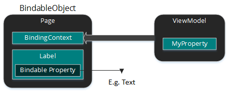

## Bindable Properties là gì ?

Xem hình demo dưới đây:



Binding là 1 quá trình kết nối 1 BindableProperty tới 1 property của BindingContext. Thường thấy là 1 property của 1 phần tử UI kết nối đến 1 property của ViewModel. 

Bindable properties là 1 thuộc tính mở rộng của CLR (Common Language Runtime) bằng cách thêm 1 type [`BindableProperty`](https://docs.microsoft.com/en-us/dotnet/api/xamarin.forms.bindableproperty)  thay cho việc thêm 1 field. Mục đích của Bindable Properties là cung cấp thêm 1 hệ thống thuộc tính mà có thể hổ trợ data binding, styles, templates,  và giá trị được set thông qua quan hệ parent-child. Ngoài ra, bindable property còn có thể dùng để set những giá trị mặc định, xác thực dữ liệu (validation), và callback gọi khi có sự thay đổi của các thuộc tính.

Các property nên implement bindable properties để hỗ trợ được các mục đích như sau:

* Biến đổi dữ liệu để hợp lệ dữ liệu với data binding.
* Setting các thuộc tính thông qua \`style\`
* Cung cấp giá trị default mà khác với giá trị default của type của property.
* Xác thực dữ liệu của property.
* Theo dõi sự thay đổi của giá trị.

## Cách tạo Bindable Property:

1. Tạo instance Bindable Property với hàm [`BindableProperty.Create`](https://docs.microsoft.com/en-us/dotnet/api/xamarin.forms.bindableproperty.create)

2. Khai báo phương thức truy cập tới Bindable Property (Get, Set) cho property.

>  **Lưu ý**:
>
>
>
> Tất cả mọi instance của Bindable Property phải được tạo ở thread UI. Nếu tạo ở các thread khác phải sử dụng: [`Device.BeginInvokeOnMainThread`](https://docs.microsoft.com/en-us/dotnet/api/xamarin.forms.device.begininvokeonmainthread#Xamarin_Forms_Device_BeginInvokeOnMainThread_System_Action_)

### Tạo 1 property:

```csharp
public static readonly BindableProperty EventNameProperty =
  BindableProperty.Create ("EventName", typeof(string), typeof(EventToCommandBehavior), null);
```

### Khai báo cách thức truy cập:

```csharp
public string EventName
{
  get { return (string)GetValue (EventNameProperty); }
  set { SetValue (EventNameProperty, value); }
}
```

## Cách sử dụng Bindable Property:

### Xử dụng trong XAML

```xml
<ContentPage ... xmlns:local="clr-namespace:EventToCommandBehavior" ...>
  ...
</ContentPage>
```

Và nơi cần dùng :

```xml
<ListView ...>
  <ListView.Behaviors>
    <local:EventToCommandBehavior EventName="ItemSelected" ... />
  </ListView.Behaviors>
</ListView>
```

### Xử dụng bằng code:

```csharp
var listView = new ListView ();
listView.Behaviors.Add (new EventToCommandBehavior
{
  EventName = "ItemSelected",
  ...
});
```

## Cách thức khác:

### Xem dữ liệu thuộc tính thay đổi:

```csharp
public static readonly BindableProperty EventNameProperty =
  BindableProperty.Create (
    "EventName", typeof(string), typeof(EventToCommandBehavior), null, propertyChanged: OnEventNameChanged);
...

static void OnEventNameChanged (BindableObject bindable, object oldValue, object newValue)
{
  // Property changed implementation goes here
}
```

### Xác thực dữ liệu:

```csharp
public static readonly BindableProperty AngleProperty =
  BindableProperty.Create ("Angle", typeof(double), typeof(HomePage), 0.0, validateValue: IsValidValue);
...

static bool IsValidValue (BindableObject view, object value)
{
  double result;
  bool isDouble = double.TryParse (value.ToString (), out result);
  return (result >= 0 && result <= 360);
}
```

### Coerce value callbacks

```csharp
public static readonly BindableProperty AngleProperty = BindableProperty.Create (
  "Angle", typeof(double), typeof(HomePage), 0.0, coerceValue: CoerceAngle);
public static readonly BindableProperty MaximumAngleProperty = BindableProperty.Create (
  "MaximumAngle", typeof(double), typeof(HomePage), 360.0, propertyChanged: ForceCoerceValue);
...

static object CoerceAngle (BindableObject bindable, object value)
{
  var homePage = bindable as HomePage;
  double input = (double)value;

  if (input > homePage.MaximumAngle)
  {
    input = homePage.MaximumAngle;
  }
  return input;
}

static void ForceCoerceValue(BindableObject bindable, object oldValue, object newValue)
{
  bindable.CoerceValue(AngleProperty);
}
```

### Tạo giá trị mặc định:

```csharp
public static readonly BindableProperty SizeProperty =
  BindableProperty.Create ("Size", typeof(double), typeof(HomePage), 0.0,
  defaultValueCreator: bindable => Device.GetNamedSize (NamedSize.Large, (Label)bindable));
```