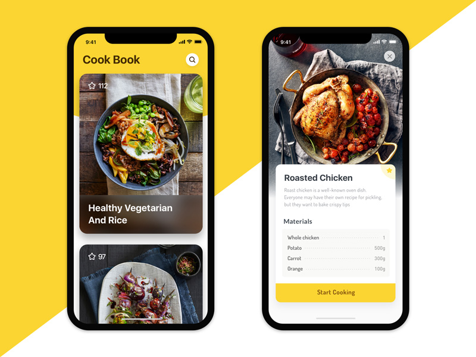

Xây Dựng app theo design :

Design 1:


Design 2:



Figma link: [here](https://www.figma.com/file/PR7CQoRfOGStg2c7qNWQCt/Cook-Book?node-id=0%3A1)

## Một số chú ý về design Cook Book :

* Thiết kế trên iphoneX/XS
* a

## Tool sử dụng:

* <https://github.com/kphillpotts/XDtoXF>: tool export XD to Xaml.
* a

## Các bước thực hiện:

1. #### Tạo project với VS 
2. #### Config cho App:

a. Style Color 

Trong App.xaml file: thêm cấu hình <Color/>

```xml
<Application.Resources>

        <Color x:Key="close_button_textcolor">#8F8D8F</Color>
        <Color x:Key="close_button_background">#DDDFE0</Color>
        <Color x:Key="white">#FFFFFF</Color>
        <Color x:Key="details_title">#424951</Color>
        <!--<Color x:Key="">#FDF8D8</Color>-->
        <Color x:Key="description">#A4A6A8</Color>
        <Color x:Key="ingredient_list">#FAFBF8</Color>
        <Color x:Key="app_title">#4E3000</Color>
        <Color x:Key="ingredient_name">#6E6E6C</Color>
        <!--<Color x:Key="">#FBFBFB</Color>-->
        <Color x:Key="button_color">#966900</Color>
        <Color x:Key="main_yellow">#FDDB00</Color>

    </Application.Resources>
```

b. Cấu hình cho mainPage: 

* Build TopBar

  ```xml
  <Grid Padding="16">
              <Grid.RowDefinitions>
                  <RowDefinition Height="60"/>
                  <RowDefinition Height="*"/>
              </Grid.RowDefinitions>

              <Grid.ColumnDefinitions>
                  <ColumnDefinition Width="*"/>
                  <ColumnDefinition Width="36"/>
              </Grid.ColumnDefinitions>
          </Grid>
  ```
* Add Image topbar: data here
* 
* Tạo thư mục `Resource` trong proj share để dùng chung
* Kéo image svg phía trên vào , phải chuột item chọn `build action -> embed resource`
* thêm nuget package : ffloadingimage.svg.form cho cả 3 (proj share/ ios/ android)
* Edit text Cook book : vị trí & font size ( [https://docs.microsoft.com/en-us/xamarin/xamarin-forms/user-interface/text/fonts)](https://docs.microsoft.com/en-us/xamarin/xamarin-forms/user-interface/text/fonts)

  ```xml
  <Label Text="Cook book" Margin="32,0,16,16" VerticalOptions="Center" VerticalTextAlignment="Center" TextColor="{StaticResource app_title}" FontFamily=".SFUIText-Semibold" FontSize="34" />
  ```
* Add ff image svg before label Cook book.

  ```
  <ff:SvgCachedImage Margin="0,-160,0,0" Source="resource://topshape.svg" HeightRequest="400" VerticalOptions="Start" Aspect="AspectFill" />
  ```

c. Cấu hình list view item với Collection View: ( data load về từ link: https://www.thewissen.io/pancakes.json)

* Xây dựng model pancake
* Xây dựng phương thức load data.
* Update Collection View

#### 3. Build Detail Page: 

> Xem ở bài tiếp theo