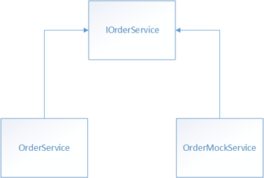

Mobile apps có những vấn đề đặc biệt mà trên desktop app hoặc web app không bao giờ có. 
Vd nhiều loại thiết bị khác nhau, ảnh hưởng tốc độ, trải nghiệm người dùng giữa ios/android, 
kết nối mạng, những dịch vụ mà thiết bị hỗ trợ ...
Do đó cần phải test rất kỹ trên mobile app để đưa ra thị trường ứng dụng có chất lượng, 
ổn định & có hiệu suất tốt.

Có rất nhiều loại test trên mobile, điển hình như: unit testing, integration testing & user interface testing. Nhưng với unit testing là phổ biến nhất, trong bài này sẽ chỉ tập trung vào unit test.

## Unit Test là gì ?

  * Kiểm thử 1 unit nhỏ của app, thường là 1 phương thức, cô lập phương thức đó với các thành phần khác trong code. Xác minh nó hoạt động theo đúng chức năng.
  * Mục tiêu: kiểm tra mỗi unit hoạt động theo đúng mong đợi theo design, để không làm sinh ra các lỗi khác trong ứng dụng - khó khăn khi debug vì ko biết lỗi phát sinh từ đâu.

## Tại sao cần có Unit Test?

  * Để phát hiện ra lỗi ngay trong từng unit. Tránh sau này khi có quá nhiều code - sinh lỗi mất rất nhiều thời gian để debug.
  * Để đánh giá lại các function nào vẫn hoạt động tốt sau khi nâng cấp các lib / update những phần liên quan đến proj ...

## 1 dự án thì tiến hành implement Unit Test như thế nào ?

Thường đi theo mẫu: `arrange-act-assert`
* Arrange: Khởi tạo các đối tượng & set giá trị truyền vào cho các phương thức để thử nghiệm.
* Act: Gọi các phương thức cần test với các arguments được yêu cầu.
* Assert: Xác minh các hoạt động của phương thức cần test thực hiện đúng như mong đợi.

 ### Cách thức test với:

#### 1. Dependency Injection and Unit Testing:

Một cách thức để áp dụng kiến trúc : loosely-coupled (liên kết lỏng lẻo) là để phục vụ cho unit test. Ví dụ sử dụng DI với Autofac như sau:

```csharp
public class OrderDetailViewModel : ViewModelBase  
{  
    private IOrderService _ordersService;  

    public OrderDetailViewModel(IOrderService ordersService)  
    {  
        _ordersService = ordersService;  
    }  
    ...  
}
```

`OrderDetailViewModel` class có phụ thuộc vào `IOrderService` type với `container` khi mà khởi tạo đối tượng `OrderDetailViewModel`. Xem thêm phần Denpendence Injection (DI) để rõ hơn. Lúc này để test `OrderDetailViewModel` class thì chúng ta sẽ tạo 1 đối tượng `OrderService` giả ( mock ) cho mục đích test. 

Xem hình dưới:



Cách làm này chấp nhận 1 đối tượng `OrderService` được truyền vào class `OrderDetailViewModel` vào thời điểm runtime & lúc để test unit `OrderDetailViewModel`. Khi test thì nó sẽ truyền vào đối tượng giả : `OrderMockService`. Lợi ích lớn nhất của việc này là có thể test với dữ liệu giả mà ko cần phải sử dụng web service hoặc cấu hình database rất phức tạp & tốn thời gian khi kiểm thử.

#### 2. Testing MVVM Applications

Test `models & view model` từ MVVM thì cũng giống kỹ thuật với việc test các class khác ( sử dụng unit test & data giả ). Tuy nhiên có 1 số pattern điển hình cho `model & view model` mà có cái lợi riêng khi sử dụng testing unit.

> TIP:

> Test one thing with each unit test. Don't be tempted to make a unit test exercise more than one aspect of the unit's behavior. 
> Doing so leads to tests that are difficult to read and update. It can also lead to confusion when interpreting a failure.

*Tạm dịch như sau:*

> Test 1 vấn đề cho mỗi unit test.
> Đừng ham test nhiều hơn mong đợi của 1 unit test.
> Nếu ko thì các test case sẽ trở nên khó đọc và khó update.
> Khả năng tạo ra những nhầm lẫn khi giải thích 1 cái lỗi nào đó.

Trong **eShopOnContainers mobile App** dùng xUnit (xunit.github.io) để kiểm thử. Nó hỗ trợ 2 kiểu unit test khác nhau:

* Test các trường hợp luôn luôn đúng.
* Test với tập theo lý thuyết là luôn đúng với tập hợp dữ liệu cụ thể nào đó.

Mỗi unit test trong **eShopOnContainers mobile App** là những `fact test`, mỗi unit test method sẽ được kèm theo với thuộc tính : `[Fact]`

> Note:

> xUnit tests are executed by a test runner. To execute the test runner, run the eShopOnContainers.TestRunner project for the required platform.

##### 2.1 Testing Asynchronous Functionality ( Test chức năng bất đồng bộ)

Khi implement theo mẫu MVVM, thì view models thường sẽ gọi các service khác để xử lý, và nó thường là các function bất đồng bộ (asynchronous). Để test code trong trường hợp này thì ta sẽ dùng service giả theo ví dụ sau:
```csharp
[Fact]  
public async Task OrderPropertyIsNotNullAfterViewModelInitializationTest()  
{  
    var orderService = new OrderMockService();  
    var orderViewModel = new OrderDetailViewModel(orderService);  

    var order = await orderService.GetOrderAsync(1, GlobalSetting.Instance.AuthToken);  
    await orderViewModel.InitializeAsync(order);  

    Assert.NotNull(orderViewModel.Order);  
}
```
Unit test này sẽ kiểm tra thuộc tính `Order` của `OrderDetailViewModel` instance sẽ có giá trị sau khi phương thức `InitializeAsync` được gọi. Phương thức này sẽ được gọi khi view tương ứng với `view model` này được Navigate tới.

Khi `OrderDetailViewModel` được khởi tạo thì nó sẽ mong đợi 1 tham số là đối tượng `OrderService` được truyền vào. Tuy nhiên, `OrderService` sẽ nhận dữ liệu từ web service. Do đó để test ta phải tạo 1 mock service `OrderMockService` để test.

##### 2.2 Testing INotifyPropertyChanged Implementations

##### 2.3 Testing Message-based Communication

##### 2.4 Testing Exception Handling

##### 2.5 Testing Validation

## Tổng Kết:

Nguồn từ: `https://docs.microsoft.com/en-us/xamarin/xamarin-forms/enterprise-application-patterns/unit-testing`