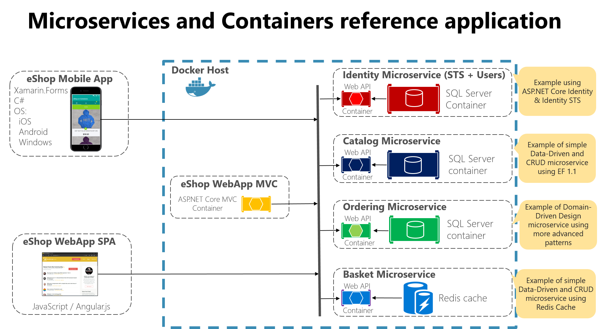
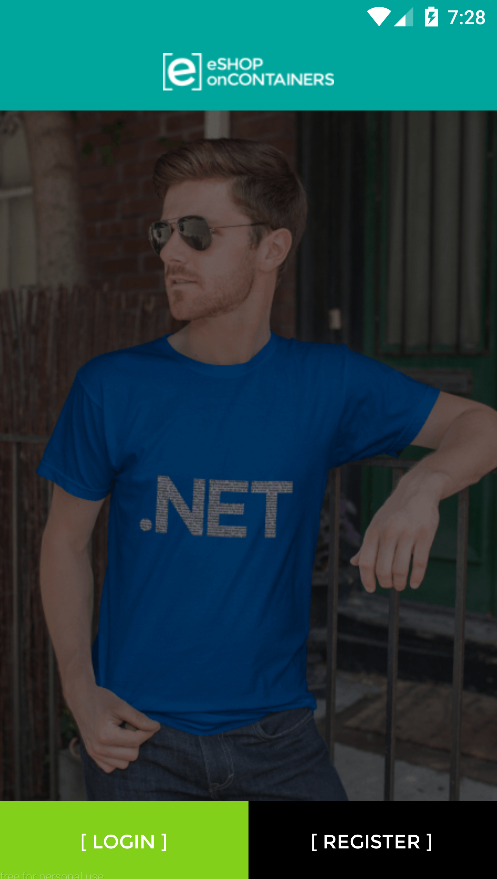
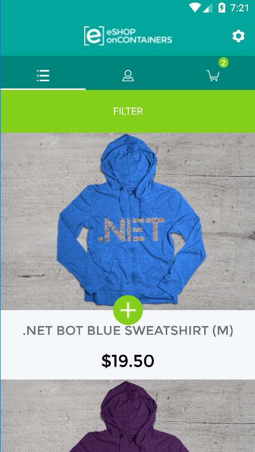
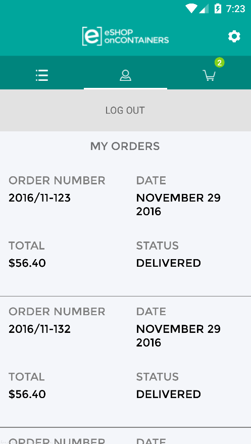
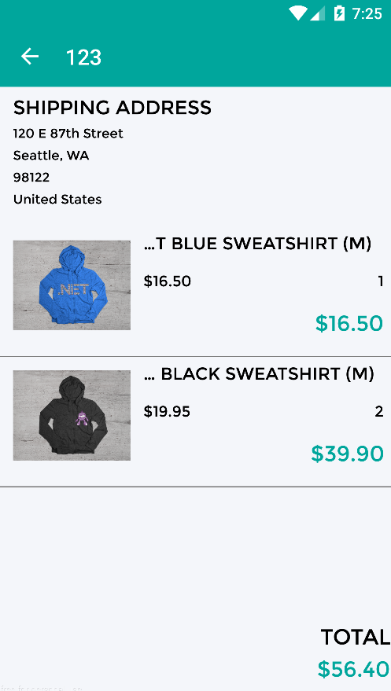
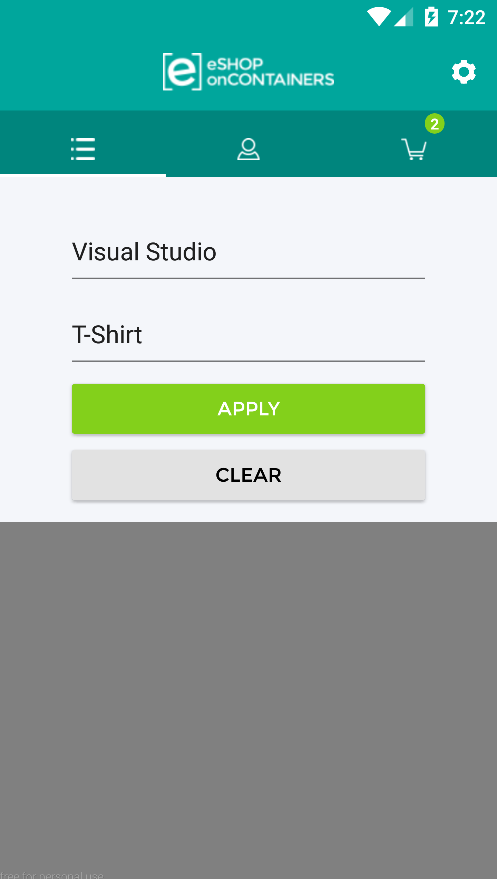
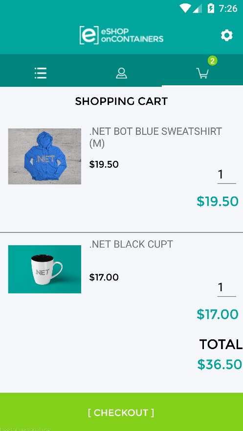

Trong phần này sẽ nói tóm lược về cuốn sách : Enterprise Application Patterns using Xamarin.Forms eBook.

Tất cả phần này sẽ nói về cách implement mẫu MVVM, dependency injection , navigation, validation, và configuration management với việc duy trì các thành phần kết nối lỏng lẻo để có khả năng tích hợp unit test. Ngoài ra còn hướng dẫn tích hợp authentication & authorization với IdentityServer. Truy cập data từ các microservice & unit test.

## 1 Ứng dụng Enterprise thường sẽ :

* Có những yêu cầu thay đổi liên tục.
* Có những cơ hội & thách thức kinh doanh mới phải thêm những cái mới.
* Trong quá trình phát triển, luôn luôn có feedback nên luôn thay đổi scope của proj & các yêu cầu của proj.

Với tất cả điều đó, yêu cầu build app có thể thay đổi và mở rộng liên tục là rất quan trọng. Để làm được điều này thì xây dựng 1 kiến trúc tốt thực sự rất khó. Thông thường chúng ta lập trình thường tạo ra 1 ứng dụng có những liên kết rất chặt, tạo nên 1 kiến trúc nguyên khối và không tách rời giữa các thành phần.  Việc này dẫn đến việc rất khó để mở rộng & bảo trì vì nó khó có thể giải quyết các bug mà ko phá vỡ các thành phần khác (component) trong app. Và rất khó để thêm tính năng mới hoặc thay thế các tính năng cũ.

Cách giải quyết vấn đề trên là tách rời các thành phần của ứng dụng & làm cho liên kết giữa các thành phần lỏng lẻo & chúng có khả năng kết hợp lại được với nhau tạo thành 1 ứng dụng. Nó sẽ có rất nhiều lợi ích: 

* Cho phép các function độc lập được phát triển, bảo trì & vận hành bởi các team khác nhau.
* Nó thúc đẩy việc tách rời các thành phần với nhau & tăng khả năng tái sử dụng.
* Tách biệt vai trò của nhóm và mỗi nhóm sẽ có khả năng tập trung vào chuyên môn của mình. 

***Nhưng nó cũng có 1 số vấn đề cần phải giải quyết khi tách rời các thành phần như:***

* Làm thế nào để tách rời các thành phần UI & Business Logic ( MVVM)
* Xác định các thành phần nào sẽ sử dụng dependency injection container
* Xác định việc liên lạc giữa các thành phần trong ứng dụng ntn mà vẫn tạo được sự kết nối lỏng lẻo ( MessengingCenter)
* Quyết định việc điều hướng giữa các page, làm thế nào để điều hướng ( Navigation)
* Xác thực đầu vào để tránh ứng dụng  bị lỗi ( Validation)
* Xác định Auth & làm sao để bảo mật được thông tin ( Authorization & Authentication)
* Truy cập dữ liệu từ xa, từ web service & cache chúng. ( Access Remote Data)
* Cách thức testing app. ( Unit Testing)

Tất cả vấn đề trên sẽ được hướng dẫn lần lượt qua các phần của serial : Xây dựng ứng dụng chuyên nghiệp với Xamarin.

## Xây dựng ứng dụng chuyên nghiệp với Xamarin sẽ tập trung vào các phần:

* XAML
* Controls
* Bindings
* Converters
* Styles
* Animations
* Commands
* Behaviors
* Triggers
* Effects
* Custom Renderers
* MessagingCenter
* Custom Controls

## Phân tích ứng dụng mẫu của microsoft trong việc xây dựng ứng dụng Enterprise:

Kiến trúc Mobile App **eShopOnContainers**:

| Folder      | Description                                                                                                       |
| ----------- | ----------------------------------------------------------------------------------------------------------------- |
| Animations  | Contains classes that enable animations to be consumed in XAML.                                                   |
| Behaviors   | Contains behaviors that are exposed to view classes.                                                              |
| Controls    | Contains custom controls used by the app.                                                                         |
| Converters  | Contains value converters that apply custom logic to a binding.                                                   |
| Effects     | Contains the `EntryLineColorEffect` class, which is used to change the border color of specific `Entry` controls. |
| Exceptions  | Contains the custom `ServiceAuthenticationException`.                                                             |
| Extensions  | Contains extension methods for the `VisualElement` and `IEnumerable` classes.                                     |
| Helpers     | Contains helper classes for the app.                                                                              |
| Models      | Contains the model classes for the app.                                                                           |
| Properties  | Contains `AssemblyInfo.cs`, a .NET assembly metadata file.                                                        |
| Services    | Contains interfaces and classes that implement services that are provided to the app.                             |
| Triggers    | Contains the `BeginAnimation` trigger, which is used to invoke an animation in XAML.                              |
| Validations | Contains classes involved in validating data input.                                                               |
| ViewModels  | Contains the application logic that's exposed to pages.                                                           |
| Views       | Contains the pages for the app.                                                                                   |

### App sẽ có các chức năng:

* Quản lý danh mục
* Quản lý các sản phẩm.
* Quản lý giỏ hàng
* Quản lý các đơn hàng

### Biểu đồ Kiến trúc:

### Các màn hình trong app:

* a auth screen

  
* a catalog list

  
* a profile section with a order list

  
* a readonly order detail screen

  
* a customizable basket

  
* a checkout screen

  